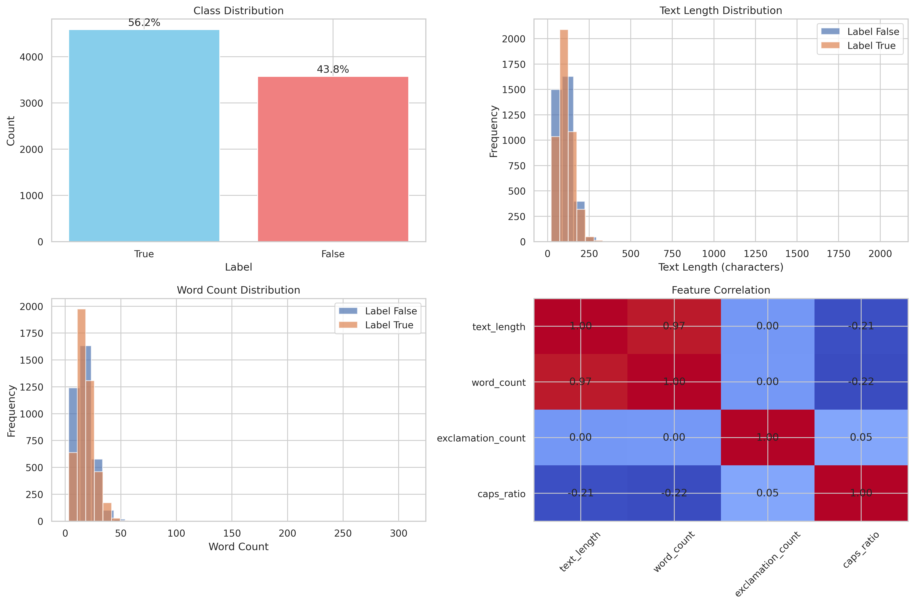

# Seminární práce k předmětu "Úvod do strojového učení" <!-- omit from toc -->

***Odhalování nepravdivých zpráv pomocí metod strojového učení***

Univerzita Jana Evangelisty Purkyně  
Přírodovědecká fakulta  
Katedra informatiky

**Autor**: *Martin Žoha*  
**Datum**: 10. 8. 2025

## Obsah <!-- omit from toc -->

- [1. Abstrakt](#1-abstrakt)
- [2. Úvod](#2-úvod)
- [3. Inspirace](#3-inspirace)
- [4. Technické řešení](#4-technické-řešení)
  - [4.1. Použité nástroje](#41-použité-nástroje)
  - [4.2. Stahování a příprava data](#42-stahování-a-příprava-data)
  - [4.3. Výběr modelů a jejich trénink](#43-výběr-modelů-a-jejich-trénink)
- [5. Diskuze a závěr](#5-diskuze-a-závěr)

## 1. Abstrakt

Tato práce je zaměřena na odhalování lživých zpráv pomocí metod strojového učení. K trénování byla využita zjednodušená datová sada LIAR: A BENCHMARK DATASET FOR FAKE NEWS DETECTION s vyváženým poměrem mezi pravdivými a lživými zprávami.

Model je spojením logistické regrese a náhodného lesa a navíc kombinuje textovou a číselnou reprezentaci posuzovaných zpráv. Pro další zlepšení výkonu modelu a minimalizaci přetrénování modelu je využita optimalizace hyperparametrů pomocí Optuna.

Nejlepších výsledků dosahuje právě toto propojení několika přístupů zároveň, které na validační sadě dosahuje F1 skóre 0,6345 a v křížové validaci dosahuje průměrného F1 skóre 0,6403 ± 0,0087. Přestože model vykazuje vysoký výkon na trénovacích datech (F1 skóre 0,8510), rozdíl oproti validační sadě značí přetrénovanost. I přes snahu o robustní optimalizaci a kombinaci přístupů není dosaženo znatelného zlepšení.

---

## 2. Úvod

Tato práce je zaměřena na odhalování lživých zpráv na základě jejich titulků. V současné době je dostupné nepřeberné množství informačních zdrojů a není v silách jednotlivců všechny sledovat, každý důkladně přečíst a následně kriticky zhodnotit pravdivost dané zprávy. Tento model usnadňuje rozhodování, zda je titulek zprávy spíše pravdivý či nikoliv. Cílem práce je vložit modelu titulek dané zprávy a model vyhodnotí zda zpráva stojí za bližší čtení.

---

## 3. Inspirace

Inspirací k napsání této práce je nespočet projektů k odhalování lživých zpráv na obdobných datových sadách dostupných nejen na [kaggle.com](https://www.kaggle.com/ "kaggle.com"), na které autor narazil při rešerši k danému tématu. Původním záměrem byla klasifikace hlasových signálů, kterou autor již zpracovával bez použití strojového učení ([Voiced_analyzer na Github.com](https://github.com/Zohino/voiced_analyzer "Klasifikace hlasových záznamů od Martina Žohy")). Ta se ovšem ukázala jako stěží řešitelná bez použití pokročilých metod strojového učení, a proto je přistoupeno ke klasifikaci textových dat, která jsou jednodušší na zpracování.

Cílem je úkazat, že uspokojivých výsledků lze dosáhnout i bez v současné době moderních velkých jazykových modelů na osobních počítačích s nižším výkonem.

---

## 4. Technické řešení

### 4.1. Použité nástroje

Celý projekt je napsán v programovacím jazyku Python verze 3.12 a dostupných knihoven a nástrojů pro tento jazyk. Pro replikovatelnost a jasnou strukturu projektů je využit nástroj [`cookiecutter-data-science` od DrivenData](https://cookiecutter-data-science.drivendata.org/ "Cookiecutter Data Science"), který vytváří stromovou strukturu, instaluje základní nástroje pro vědecké využití jazyka Python a poskytuje vzorový kód.

Pro správu prostředí a instalaci knihoven je použito [`uv`](https://docs.astral.sh/uv/), jehož devizou je rychlost řešení konfliktů jednotlivých balíčků a správa projektů. Nástroj je napsán v jazyce Rust a je moderním nástupcem obdobných nástrojů, jako je `pyenv` a `Poetry`.

Pro zachování jednotného stylu kódu je využit linter a formátovač [`ruff`](https://docs.astral.sh/ruff/) od stejného týmu jako uv. Taktéž je napsán v jazyku Rust a nahrazuje několik nástrojů.

Pro celkovou automatizaci projektu a spouštění jednotlivých skriptů je zvolen [GNU `make`](https://www.gnu.org/software/make/) díky své standardní dostupnosti na většině linuxových distribucí. Existuje verze i pro použití na operačních systémech Windows, ale příkazy se kvůli prostředí liší a pro použití v tomto projektu je potřeba patřičně upravit [`Makefile`](../Makefile). Makefile obsahuje předdefinované příkazy pro kompletní běh projektu od vytvoření prostředí, po výstupy jednotlivých skriptů a spuštění jednotlivých jupyter sešitů. Vše je možné spustit hromadně nebo po dílčích krocích.

Pro prezentaci a komunikaci jednotlivých kroků jsou využity jupyter sešity. Z ostatních knihoven a nástrojů jsou pak využity následující:

- jupyterlab + ipykernel – práce s jupyter sešity
- loguru – hezčí a logování
- matplotlib, numpy, pandas, seaborn – standardní vědecké balíčky
- optuna – optimalizace hyperparametrů
- python-dotenv – konfigurace prostředí, nevyužito
- scikit-learn – práce s daty a modely strojového učení
- tqdm – přehlednější ukazatel postupu v terminálu
- typer – interaktivita se skripty v příkazové řádce, jednoduché vytváření nástrojů příkazové řádky
- papermill – spouštění sešitů bez jejich otevření

### 4.2. Stahování a příprava data

K učení modelu je využita zjednodušená datová sada LIAR: A BENCHMARK DATASET FOR FAKE NEWS DETECTION dostupná na [github.com](https://github.com/nishitpatel01/Fake_News_Detection "Fake News Detection by nishitpate101"). Plná verze této datové sady slouží k porovnávání modelů strojového učení pro detekci falešných zpráv. Oproti zjednodušené sadě jsou titulky řazeny do několika kategorií podle pravděpodobnosti jejich pravosti. Zjednodušená datová sada již obsahuje právě dvě kategorie True a False podle pravděpodobné pravosti zprávy. Tím je zjednodušeno učení modelu a řazení pouze do dvou kategorií. Sada je navíc již rozdělena na trénovací a testovací data. Rozdělení dat a jejich vlastnosti jsou k náhlednutí v [notebooks/0.1-mz-initial-eda.ipynb](../notebooks/0.1-mz-initial-eda.ipynb "Úvodní prozkoumání dat").

Po stažení jsou soubory validovány, zda obsahují očekávaná data v očekávaných sloupcích. Po validaci je přistoupeno k jejich čištění a vytváření charakteristických vlasností jednotlivých textů. Z dat jsou tak odstraněny například HTML značky, e-mailové adresy, odstraněny speciální znaky a text je standardizován (převeden na malá písmena, odstraněny nadbytečné mezery).

Z očištěných a standardizovaných titulků jsou následně vytvořeny jejich vlastnosti vhodné pro učení modelů. Takovými vlastnostmi jsou například počet otazníků, počet velkých písmen nebo počet slov a s tím související délka nadpisů. Veškerá příprava dat je k náhlednutí v určeném [sešitu](../notebooks/1.1-mz-data-cleaning-and-feature-creation.ipynb "Čištění a příprava dat") nebo použitém [skriptu](../src/preprocessing/preprocessing.py "Příprava a čištění dat - skript").

### 4.3. Výběr modelů a jejich trénink

V první verzi byla zvolena pouze logistická regrese na textových datech, která sama o sobě dosahovala překvapivě dobrých výsledků. Pro další zlepšení byla tato sloučena s náhodným lesem. Tyto dvě metody společným hlasováním určují pravdivost zpráv. K vyhodnocování mohou modely využít číselných nebo textových vlastností titulků. Na základě optimalizace je ovšem využita kombinace všech vlastností. Navzdory robustnějšímu přístupu není dosaženo znatelně lepších výsledků. I přes rozsáhlou optimalizaci hyperparametrů pomocí Optuna nebylo dosaženo takových výsledků, aby se vyplatilo optimalizovat za cenu časové ztráty a výpočetního výkonu. Při každém novém trénování modelu je tak ponechána pouze krátké ladění parametrů.

F1 skóre na trénovacích datech je 0,851, což je hodnota, která byla na začátku experimentu při použití jednodušších modelů očekávaná. Naproti tomu hodnota F1 na testovacích datech je pouze 0.6345, což značí přetrénovanost modelu na trénovací data. Tuto hranici se bohužel nedaří při současném přístupu překročit.

Řešením by mohlo být další navýšení trénovacích dat, ovšem tento přístup pravděpodobně nevylepší výsledky nijak citelně, protože výchozí datová sada je již velmi kvalitní. Dalším možným řešením je využití dalšího modelu v kombinaci s již využitou logistickou regresí a náhodným lesem. Případně je možné rovné využít pokročilejší specializovaný model. To ovšem popírá základní premisu této práce, že detekce je možná i se slabším modelem na méně výkonných strojích.

Autor pokračuje v dalším výzkumu a případná zlepšení budou implementována do této práce v budoucnu kvůli současným časovým možnostem.

---

## 5. Diskuze a závěr

V současném rozsahu práce slouží jako studie proveditelnosti. Přes zjištěné nedostatky v detekci na validačních datech považuje autor za prokázané, že i při použití menších a výpočetně nenáročných modelů lze relativně spolehlivě detekovat nepravdivé titulky zpráv. Modely nemohou nahradit kritické myšlení uživatele i přes další vývoj těchto modelů. Nejdůležitější tak zůstává volba ověřených zdrojů zpráv a informací.

Další omezení spatřuje autor v zaměření se pouze na titulky zpráv. Současná klasifikace nevypovídá nic o obsahu úplné zprávy. Titulek může být úmyslně zavádějící nebo nepřesný, aby vyvolal reakce čtenářů, tzv. clickbait. Kvůli tomuto může být i hodnotná zpráva vyhodnocena jako nepravdivá.

Navzdory použití těch nejjednodušších modelů bylo dosaženo nadprůměrně spolehlivé detekce. S dalším navyšováním výpočetního výkonu koncových zařízení uživatelů tak není třeba se obávat použití i výkonnějších modelů, které mohou běžet čistě lokálně a stále velmi dobře plnit svůj účel. Bohužel i přes snahu autora není tento model prozatím k tomuto účelu vhodný.
